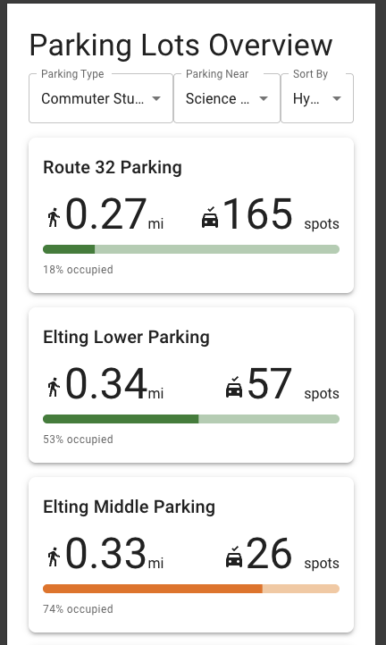

Parking Congestion Web App

A full-stack Next.js + MongoDB application for managing parking lots, detecting unauthorized vehicles, and reporting parking-related incidents.
This system provides tools for administrators, enforcement officers, and visitors to view, monitor, and report parking lot activity efficiently.

#TABLE OF CONTENTS

Overview

Features

Tech Stack

Project Structure

MongoDB Schema

API Endpoints

Setup Instructions

Testing the App

Troubleshooting

Future Enhancements

# Overview

Parking Congestion Web App helps track real-time parking availability, detect overstayed or unauthorized vehicles, and file parking incident reports.
It’s built using Next.js 16 and Material UI, with MongoDB as the backend data store.

 # Key Users

- Parking Administrators – Manage lots and view availability

- Enforcement Officers – Monitor unauthorized vehicles

- Staff/Users – Submit accident or incident reports

# Features
 -Lot Overview Dashboard

-Displays each parking lot’s:

-Occupancy rate (with MUI LinearProgress)

-Available vs. total capacity

-Sort lots by availability (ascending/descending)

-Dynamic data pulled from MongoDB

 # Enforcement Dashboard

Detects unauthorized plates parked longer than 15 minutes

Auto-refreshes every 60 seconds

Color-coded alerts:

🟡 Minor: 15–30 minutes

🔴 Major: >30 minutes

# Accident Reporting

Submit detailed incident reports with:

Reporter name

License plate

Lot ID

Description

Photo upload

Timestamp (createdAt)

Automatically saved to MongoDB

# Global Navigation

Universal <BackButton /> for page navigation

Simple and consistent Material UI interface

# Tech Stack
Layer	Technology
Frontend	Next.js 16 (App Router), React 18, TypeScript
Styling	Material UI (MUI), Tailwind CSS, Emotion SSR
Backend	Next.js API Routes, MongoDB Atlas
Deployment	Vercel or Node.js Environment
Version Control	Git & GitHub
# Project Structure
src/
│
├── app/
│   ├── page.tsx                # Home page
│   ├── layout.tsx              # App layout
│   │
│   ├── lots/                   # Parking lot overview
│   │   ├── page.tsx            # List of lots with occupancy bars
│   │   ├── components/
│   │   │   ├── LotCard.tsx     # Individual lot info display
│   │   │   └── SortButton.tsx  # Sort lots by availability
│   │
│   ├── enforcement/
│   │   ├── page.tsx            # Enforcement dashboard
│   │   └── components/
│   │       └── AlertsTable.tsx # Unauthorized cars list
│   │
│   ├── accidents/
│   │   └── page.tsx            # Accident/incident reporting form
│   │
│   └── api/
│       ├── lots/
│       │   ├── route.ts        # GET lots data
│       │   └── scan/route.ts   # POST for scanning plate in/out
│       └── enforcement/
│           └── alerts/route.ts # GET unauthorized car alerts
│
├── components/
│   └── BackButton.tsx          # Global back button
│
├── lib/
│   └── mongodb.ts              # MongoDB logic + helpers
│
└── globals.css                 # Global Tailwind + MUI styles

# MongoDB Schema
lots Collection
{
  "lotID": "0",
  "title": "Campus West Lot",
  "capacity": 50,
  "allows": {
    "commuter": true,
    "visitor": false
  },
  "scans": [
    {
      "plateNumber": "ABC1234",
      "timestamp": "2025-11-08T09:30:00Z"
    }
  ]
}

cars Collection
{
  "plate": "XYZ789",
  "owner": "Jane Doe"
}

# API Endpoints
Method	Endpoint	Description
GET	/api/lots	Retrieve all parking lots and scan counts
POST	/api/lots/scan	Log vehicle entry/exit events
GET	/api/enforcement/alerts	Fetch unauthorized vehicle alerts
POST	/api/accidents	Submit an accident report Setup Instructions
1️ Clone the Repository
git clone https://github.com/kevmill129/Parking-Congestion-WebApp.git
cd Parking-Congestion-WebApp

2️ Install Dependencies
npm install

3️ Add Environment Variables

Create a .env.local file:

MONGODB_URI="your_mongodb_connection_string"

4️ Run Development Server
npm run dev

Visit  http://localhost:3000

# Testing the App
Page	Description
/lots	View parking lots and availability
/enforcement	Monitor unauthorized vehicle alerts
/accidents	Submit new accident reports
 Troubleshooting
Issue	Possible Cause	Fix
404 on /api/lots	Missing route file	Ensure src/app/api/lots/route.ts exists
500 on /api/enforcement/alerts	Null or malformed scan data	Add null checks in findUnauthorizedPlatesOverTime()
MongoDB connection failure	Invalid or missing env var	Verify MONGODB_URI in .env.local
Hydration error	SSR mismatch in MUI	Use Emotion SSR setup and 'use client' directives properly

# Future Enhancements
 
 Real Time Updates

 Authentication for admin/enforcement roles

 Geo-location support for lot mapping

 Vehicle registration management UI

Parking projections/forecasting once a large enough sample size of data is gathered

