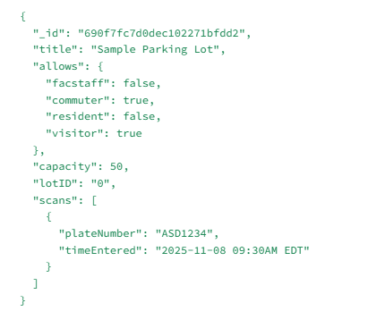

# Parking Detection System Web App

A full-stack Next.js application for managing parking lots, detecting unauthorized vehicles, and reporting parking-related incidents.
This system provides tools for administrators, enforcement officers, and visitors to view, monitor, and report parking lot activity efficiently.

# TABLE OF CONTENTS

-[Overview](#overview)

-[Features](#features)

-[Tech Stack](#techstack)

-[Project Structure](#projectstructure)

-[MongoDB Schema](#MongoDBSchema)

-[API Endpoints](#APIEndpoints)

-[Setup Instructions](#Setup)

-[Future Enhancements](#Future)

# Overview

Parking Congestion Web App helps track real-time parking availability, detect overstayed or unauthorized vehicles, and file parking incident reports.
It’s built using Next.js 16 and Material UI, with MongoDB as the backend data store.

# Key Users

- Parking Administrators – Manage lots and view availability

- Enforcement Officers – Monitor unauthorized vehicles

- Staff/Users – Submit accident or incident reports

# Features

-Lot Overview Dashboard

-Displays each parking lot’s:

-Color Coded Occupancy rate (Red for highest, orange for medium, green for lightest)

-Available vs. total capacity

-Sort lots by availability (ascending/descending)

-Sort by distance from

-Dynamic data pulled from MongoDB

-Enforcement Dashboard

-Detects unauthorized plates parked longer than 15 minutes

-Auto-refreshes every 60 seconds

-Color-coded alerts:

🟡 Minor: 15–30 minutes

🔴 Major: >30 minutes

##Accident Reporting

Submit detailed incident reports with:

-Reporter name

-License plate

-Lot ID

-Description

-Photo upload

-Timestamp (createdAt)

-Automatically saved to MongoDB

-Global Navigation

-Universal <BackButton /> for page navigation

-Simple and consistent Material UI interface

# Tech Stack

Layer Technology
Frontend Next.js 16 (App Router), React 18, TypeScript
Styling Material UI (MUI), Tailwind CSS, Emotion SSR
Backend Next.js API Routes, MongoDB Atlas
Deployment Vercel or Node.js Environment
Version Control Git & GitHub

# API Endpoints

Method Endpoint Description
GET /api/lots Retrieve all parking lots and scan counts

POST /api/lots/scan Log vehicle entry/exit events

GET /api/enforcement/alerts Fetch unauthorized vehicle alerts

POST /api/accidents Submit an accident report Setup Instructions

1. Clone the Repository

   ````git clone https://github.com/kevmill129/Parking-Congestion-WebApp.git
   cd Parking-Congestion-WebApp```

   ````

2. Install Dependencies
   npm install

3. Add Environment Variables
   Create a .env.local file:
   `MONGODB_URI="your_mongodb_connection_string"`

4. Run Development Server
   `npm run dev`

Visit http://localhost:3000

# Future Enhancements

- Authentication for admin/enforcement roles

- Vehicle registration management UI

- Parking projections/forecasting once a large enough sample size of data is gathered

# MongoDB Schema



# Example photo of Functionality


